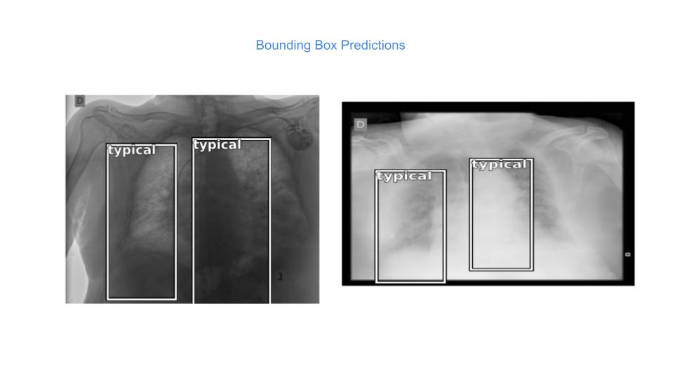

# Bounding Box generation using Image Segmentation.

This repository provides training and inferencing modules for Pneumonia Detection. This aim of this project is to provide a cookie cutter approach to generate bounding box predictions for Chest X Rays.

There are many object detection techniques are available today for generation of bounding boxes like YoloV5, R-CNN, Faster R-CNN etc. 
Segmentation is primarily a technique which marks. Here I am using segmentation to generate bounding boxes.

This project provides two functions:

1. Inferencing on Chest XRay Images to find Bounding box and associated labels. (A pretrained model is provided, but users are encouraged to train their own models based on the training script provided as below.
2.  Training of model : The data setup is explained and code is made available in the Dataset up section below. The data for traning is required in two folders names images and masks under a parent folder, say train. At time of training, the location of this folder (train) needs to be passed to the training script (train.py).

## Dataset Used

BIMCV COVID-19+ (https://www.kaggle.com/c/siim-covid19-detection/data).

## Usage

### Data Set up

The bounding box and label information is provided in csv files. For segmentation, masked images are generated from the given information which is used for model generation.

Following notebooks contain the code for data set up.
- zip-to-dcm.ipynb -  Extracts dicom files from zip files.
- dcm-to-png.ipynb -  Extracts png files from dicom files. Code for cleaning the corrupted images is also available.
- png-to-mask.ipynb - Creates mask images for corresponding X Rays using information provided in excel files.

### Source code set up 

  Get the repository: git clone https://github.com/sinharitesh/bounding-box-by-segmentation.git
  
  Change the directory: cd bounding-box-by-segmentation   
  
  Create a directory "models" in current folder: mkdir models 
  
  Change directory to models: cd models

  Download a pre trained model provided for this purpose using following in the models directory :
  
  gdown https://drive.google.com/uc?id=1-9uL0NaYMWowQdFFVzHS6Jfv3OB_ZhQp.
  
  Above will download a model named "siim-seg-011-resnet34-colab.pth".
  
  Comeback to root directory (one directory up)
 
 ### Training 
  
  Once you are in the directory containing the script train.py,  run the following command:
  
  python train.py --train_dir ../data-siim/train/ --use_model siim-seg-011-resnet34-colab.pth --epochs 1 --learning_rate .01
  
  Training will start, after the training is finished, a model named siim-segmentation-resnet34-<DDMMYYYY-HHMMSS>.pth will be available in models directory.
  
  Note: For next training session, above saved model can be passed and the training will be resumed on latest saved model.

### Inference
  
  Put the images which need to be inferenced in the folder "test/images".
  
  Some images are made available as samples. There is also a folder called labels under the folder test which contains ground truth information for images.
  This is from the perspective to visually examine the prediction done on the images. This is not a requirement for inferencing.
  
  Run the following command:
  
  python inference.py --test_dir ./test/
  
  Note that you can pass any directory which has got images subfolder containing the images to be examined.
  
  After inferencing is completed, the output as images with bounding box drawn over them is saved in the folder called outputs. 
  
  
  
  The name of the output file will be sample001_pred.png where original file name was sample001.png. In case of ground truth information is also available, there will be an additional file named as sample001_orig.png

## Architecture Used

  
## For advanced users

  
Learning rate finder

